# Page Builder — Dokumen Desain

> **Status:** Draft — Fase Diskusi  
> **Tujuan:** Mengembangkan Data Source Manager dari sekadar pelacak metadata pasif menjadi infrastruktur utama yang menggerakkan seluruh halaman dashboard, dengan cross-filter drill-down berbasis hirarki standar.

---

## 1. Pernyataan Masalah

Halaman dashboard saat ini **hardcode** sumber datanya. Setiap halaman punya API route sendiri, spreadsheet ID ter-hardcode, dan logika kolom yang terikat erat. Masalah yang ditimbulkan:

- **Rapuh**: Menambah data baru berarti menulis API route baru + kode halaman baru
- **Tanpa cross-filtering**: Setiap dataset terisolasi, tidak ada filter terpadu lintas data
- **Tanpa drill-down**: Tidak ada eksplorasi hierarkis (ULTG → GI → Bay)
- **Tidak reusable**: Struktur data yang sama terduplikasi di berbagai halaman

### Visi

Mengubah **registry** (`spreadsheet-config.json`) dari alat monitoring menjadi **sumber kebenaran tunggal** yang:
1. Menentukan sheet mana milik halaman mana
2. Memvalidasi struktur data (kolom hirarki)
3. Menggerakkan mesin cross-filter / drill-down universal
4. Pada akhirnya memungkinkan page builder tanpa kode

---

## 2. Sistem Hirarki

### 2.1 Level Hirarki

Semua sheet yang didaftarkan **wajib** memiliki kolom hirarki standar:

| Level | Nama Kolom | Wajib | Domain |
|-------|-----------|-------|--------|
| 1 | `Master ULTG` | ✅ Wajib | Unit Layanan Transmisi & GI |
| 2 | `Master Gardu Induk` | ✅ Wajib | Gardu Induk (Substation) |
| 3 | `Master Bay` | ❌ Opsional | Bay (Circuit Breaker Bay) |

### 2.2 Aturan Validasi

```
Validasi Registrasi Sheet:
    ├── Punya "Master ULTG"?           → Wajib ✅
    ├── Punya "Master Gardu Induk"?    → Wajib ✅
    ├── Punya "Master Bay"?            → Opsional (dicatat jika ada)
    │
    ├── Kedua kolom wajib ada → ✅ LAYAK didaftarkan
    └── Kurang salah satu    → ❌ DITOLAK (tidak bisa didaftar)
```

### 2.3 Extensibility (Bisa Diperluas)

Hirarki didefinisikan di config, **bukan hardcode**:

```json
{
    "hierarchyLevels": [
        { "key": "ultg",  "column": "Master ULTG",        "label": "ULTG",        "required": true  },
        { "key": "gi",    "column": "Master Gardu Induk",  "label": "Gardu Induk", "required": true  },
        { "key": "bay",   "column": "Master Bay",          "label": "Bay",         "required": false }
    ]
}
```

> [!TIP]
> Menambah level baru (misal: `Master Feeder`) tinggal tambahkan ke array ini. Semua UI drill-down, filter, dan validasi otomatis beradaptasi — **tanpa ubah kode**.

### 2.4 Alur Drill-Down UX

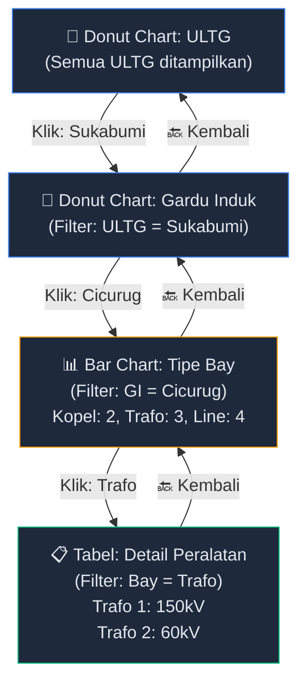

**Perilaku cross-filter**: Saat user memilih `ULTG = Sukabumi`, SEMUA komponen di halaman (chart, tabel, peta) ikut ter-filter secara bersamaan di SEMUA sheet yang terhubung.

### 2.5 Cross-Filter Dua Arah (Bi-Directional)

Drill-down **bukan hanya dari hirarki ke detail**, tapi bisa dari **kolom apa pun ke kolom apa pun**:

| Arah | Contoh | Hasil |
|------|--------|-------|
| Hirarki → Detail | Klik ULTG Sukabumi | Lihat semua peralatan di Sukabumi |
| Detail → Hirarki | Klik jenis "PMT" di donut chart | Lihat PMT ada di ULTG/GI/Bay mana saja |
| Kolom → Kolom | Klik merk "ABB" | Lihat peralatan ABB ada di mana, tipe apa |

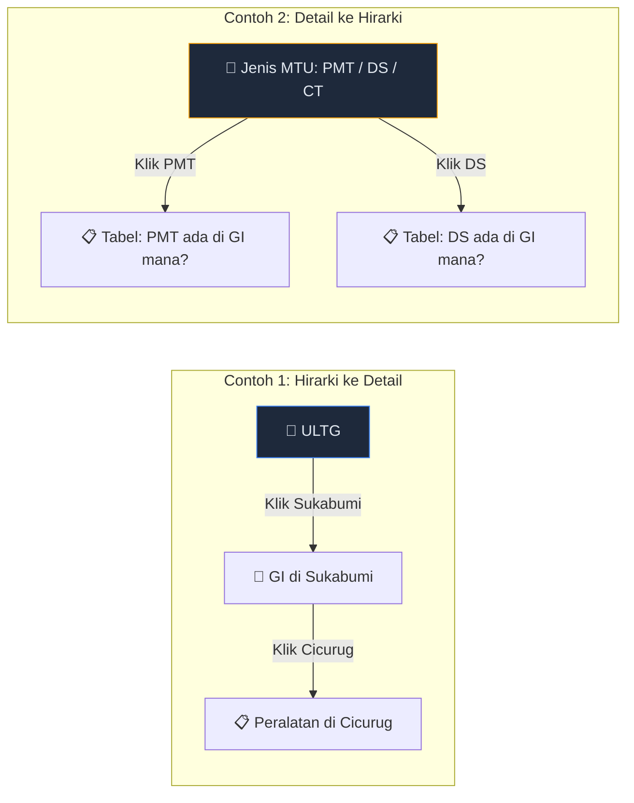

> [!IMPORTANT]
> Prinsip utama: **Klik slice/bar/row di komponen manapun → filter semua komponen lain di halaman itu**. Kolom hirarki (ULTG/GI/Bay) tetap jadi dimensi utama, tapi bukan satu-satunya yang bisa di-drill.

### 2.6 Pencocokan Kolom Hirarki (2-Level Prioritas)

Nama kolom hirarki tidak selalu pakai prefix "Master". Sistem cari dengan **2 level prioritas**:

| Level | Cari Dulu | Fallback | Required |
|-------|----------|----------|----------|
| ULTG | `Master ULTG` | `ULTG` | ✅ Wajib |
| GI | `Master Gardu Induk` | `Gardu Induk` | ✅ Wajib |
| Bay | `Master Bay` | `Bay` | ❌ Opsional |

Exact match, case-insensitive, trim whitespace. Bukan fuzzy, bukan substring.

### 2.7 Normalisasi Data (DBT-Style)

Nilai kolom hirarki dinormalisasi untuk konsistensi cross-filter:

```typescript
// "Sukabumi" / "SUKABUMI" / "sukabumi  " → "SUKABUMI"
function normalizeHierarchyValue(value: string): string {
    return value.trim().replace(/\s+/g, ' ').toUpperCase();
}
```

---

## 3. Arsitektur Registry

### 3.1 Struktur Saat Ini vs Yang Diusulkan

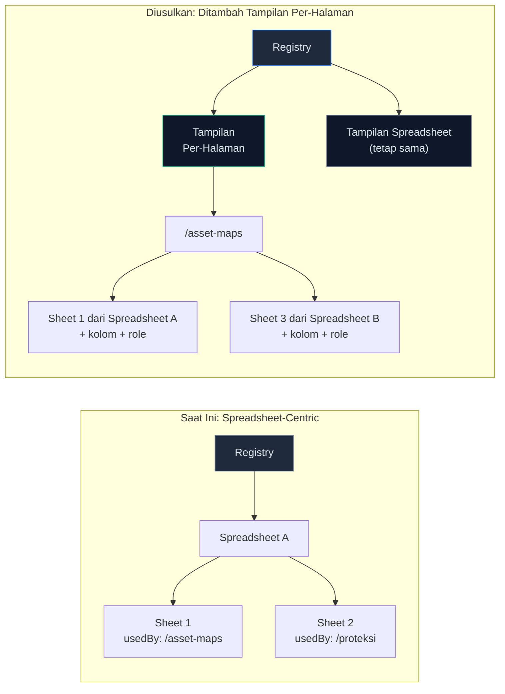

### 3.2 Skema Registry Yang Diusulkan

```json
{
    "version": 2,
    "hierarchyLevels": [
        { "key": "ultg", "column": "Master ULTG", "label": "ULTG", "required": true },
        { "key": "gi", "column": "Master Gardu Induk", "label": "Gardu Induk", "required": true },
        { "key": "bay", "column": "Master Bay", "label": "Bay", "required": false }
    ],

    "spreadsheets": [
        {
            "spreadsheetId": "1Abc...",
            "title": "Master Transmisi - UPT Bogor",
            "sheets": [
                {
                    "sheetName": "MASTER ASSET TOWER",
                    "label": "Data Tower Transmisi",
                    "usedBy": ["/asset-maps"],
                    "columnsUsed": ["NAMA", "LAT", "LNG", "KAPASITAS"],
                    "hierarchyPresent": ["ultg", "gi"],
                    "role": "map-markers"
                },
                {
                    "sheetName": "PETIR",
                    "label": "Data Petir",
                    "usedBy": ["/asset-maps"],
                    "columnsUsed": ["TANGGAL", "JUMLAH", "LAT", "LNG"],
                    "hierarchyPresent": ["ultg", "gi"],
                    "role": "heatmap-data"
                }
            ]
        }
    ]
}
```

### 3.3 Penambahan Field Baru

| Field | Tipe | Deskripsi |
|-------|------|-----------|
| `hierarchyPresent` | `string[]` | Level hirarki yang dimiliki sheet (`["ultg","gi"]` atau `["ultg","gi","bay"]`) |
| `role` | `string` | Petunjuk komponen: `"map-markers"`, `"heatmap-data"`, `"table-data"`, `"chart-data"`, atau kustom |
| `columnsUsed` | `string[]` | Hanya kolom ini yang di-fetch (kolom hirarki selalu disertakan otomatis) |

---

## 4. Arsitektur Alur Data

### 4.1 Alur End-to-End

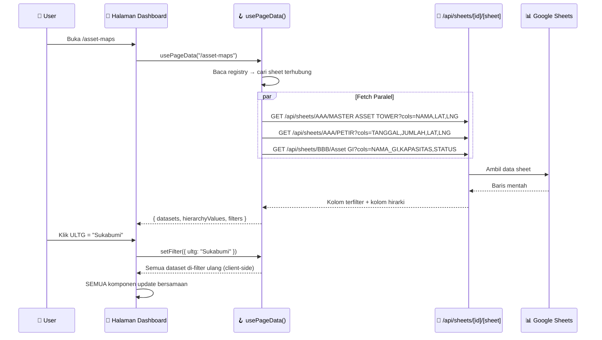

### 4.2 Desain API Hook

```typescript
// Penggunaan di komponen halaman mana pun
const {
    datasets,          // Record<role, rows[]> — data dikelompokkan per role sheet
    hierarchy,         // { ultg: string[], gi: string[], bay: string[] } — nilai yang tersedia
    filters,           // { ultg?: string, gi?: string, bay?: string } — pilihan saat ini
    setFilter,         // (level, value) => void — set filter drill-down
    clearFilter,       // (level) => void — reset dari level ini ke bawah
    breadcrumbs,       // [{ level, value }] — jalur drill saat ini
    loading,           // boolean
    error,             // string | null
} = usePageData("/asset-maps");
```

### 4.3 Logika Cross-Filter

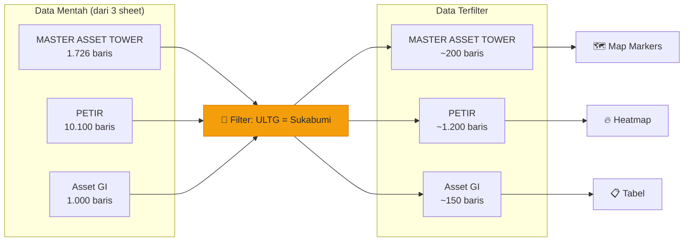

---

## 5. Sistem Role Sheet

### 5.1 Penugasan Role

Setiap sheet yang terhubung ke halaman punya **role** sebagai petunjuk komponen mana yang merender:

| Role | Aturan Auto-Detect | Komponen |
|------|-------------------|----------|
| `map-markers` | Punya kolom `LAT` + `LNG` | MapLibre markers |
| `heatmap-data` | Punya `LAT` + `LNG` + kolom numerik | Heatmap layer |
| `table-data` | Fallback default | Tabel data |
| `chart-data` | Punya kolom numerik + kategorikal | ECharts (bar/line/pie) |
| `summary-card` | Punya kolom numerik yang bisa diagregasi | Kartu KPI |
| *kustom* | Penugasan manual | Komponen kustom |

### 5.2 Logika Auto-Deteksi

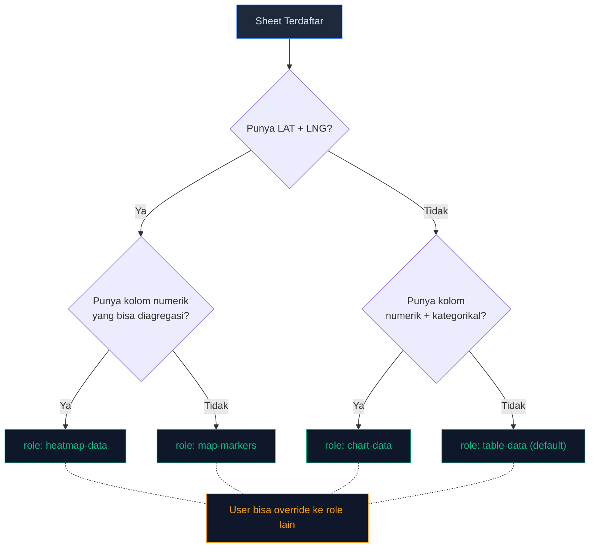

---

## 6. Alur Registrasi

### 6.1 Urutan Registrasi Lengkap

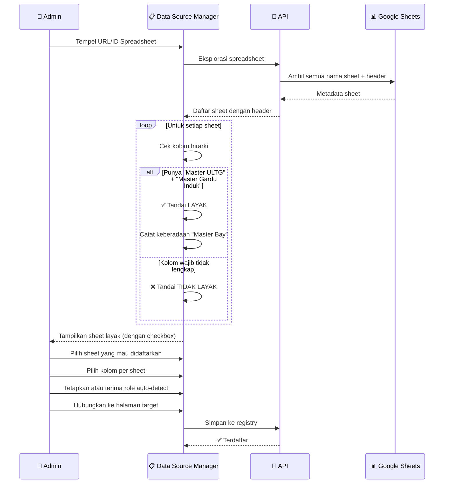

### 6.2 Konsep Mockup UI

```
┌─────────────────────────────────────────────────────┐
│  Daftarkan Spreadsheet                               │
│                                                      │
│  📊 Master Transmisi - UPT Bogor                     │
│      ID: 1Abc...XyZ                                  │
│                                                      │
│  Sheet Ditemukan:                                    │
│  ┌──────────────────────────────────────────────┐    │
│  │ ☑ MASTER ASSET TOWER                         │    │
│  │   ✅ Master ULTG  ✅ Master Gardu Induk       │    │
│  │   ❌ Master Bay (tidak ada)                   │    │
│  │   Role: 🗺️ map-markers (otomatis)            │    │
│  │   Kolom: [NAMA] [LAT] [LNG] [KAPASITAS]     │    │
│  │   Hubungkan ke: [/asset-maps ▼]              │    │
│  ├──────────────────────────────────────────────┤    │
│  │ ☑ PETIR                                      │    │
│  │   ✅ Master ULTG  ✅ Master Gardu Induk       │    │
│  │   ❌ Master Bay (tidak ada)                   │    │
│  │   Role: 🔥 heatmap-data (otomatis)           │    │
│  │   Kolom: [TANGGAL] [JUMLAH] [LAT] [LNG]     │    │
│  │   Hubungkan ke: [/asset-maps ▼]              │    │
│  ├──────────────────────────────────────────────┤    │
│  │ ☐ REF_KATEGORI  ← TIDAK LAYAK                │    │
│  │   ❌ Tidak ada: Master ULTG, Master GI        │    │
│  │   (Tidak bisa didaftar — hirarki tidak lengkap)│   │
│  └──────────────────────────────────────────────┘    │
│                                                      │
│                        [Batal]  [Daftarkan ✅]        │
└─────────────────────────────────────────────────────┘
```

---

## 7. Strategi Backward Compatibility

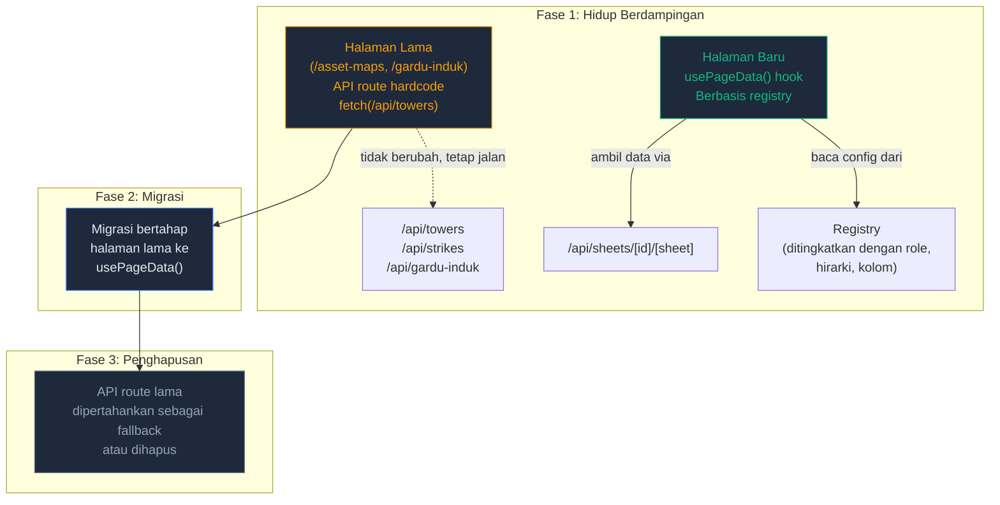

---

## 8. Fase Implementasi

### Fase 1 — Fondasi (Registry + API Generik)
- Perluas skema registry (tambah `hierarchyLevels`, `role`, `hierarchyPresent`)
- Tingkatkan alur registrasi dengan validasi hirarki
- Pastikan `/api/sheets/[...path]` mendukung filter kolom

### Fase 2 — Hook Data (`usePageData`)
- Bangun hook `usePageData(pagePath)`
- Baca registry → fetch semua sheet terhubung → return dataset bertipe
- Implementasi cross-filter sisi klien berdasarkan hirarki

### Fase 3 — Komponen Drill-Down
- Bangun komponen `<HierarchyFilter />` (drill-down donut/bar)
- Bangun `<DrillDownBreadcrumb />` untuk navigasi
- Hubungkan state cross-filter ke semua komponen chart/tabel/peta

### Fase 4 — UI Page Builder (2 Tahap)
- **Tahap A**: Data Model Editor (networking-style relationship UI)
- **Tahap B**: Dashboard Designer (drag-and-drop komponen + column picker)
- Preview langsung halaman dengan data asli

### Fase 5 — Fitur Lanjutan
- Layer caching untuk data Google Sheets
- Refresh real-time / polling
- Ekspor data terfilter (CSV/PDF)
- Izin hirarki per user (akses terbatas per ULTG)

---

## 9. Tech Stack

| Lapisan | Teknologi | Fungsi |
|---------|----------|--------|
| Registry | File konfigurasi JSON | Sumber kebenaran tunggal |
| API | Next.js API Routes | Penyajian data |
| Data | Google Sheets API | Sumber data eksternal |
| Hook Frontend | React `usePageData()` | Jembatan registry-ke-data |
| Chart | ECharts (Apache) | Visualisasi drill-down |
| Peta | MapLibre GL | Visualisasi geospasial |
| Tabel | shadcn/ui DataTable | Tampilan tabular |
| Filter | Custom hierarchy filter | Mesin cross-filter |
| Drag & Drop | React DnD / dnd-kit | Page Builder canvas |
| Relationship UI | React Flow / custom SVG | Data Model Editor |

---

## 10. UI Page Builder (Detail Desain)

Page Builder punya **2 tahap** yang dilalui user saat membuat halaman dashboard baru:

### 10.1 Tahap A — Data Model Editor (Networking Style)

Tampilan visual yang menunjukkan semua sheet terdaftar sebagai "node" dengan kolom-kolomnya. User bisa **menarik garis** antar kolom untuk membuat relasi.

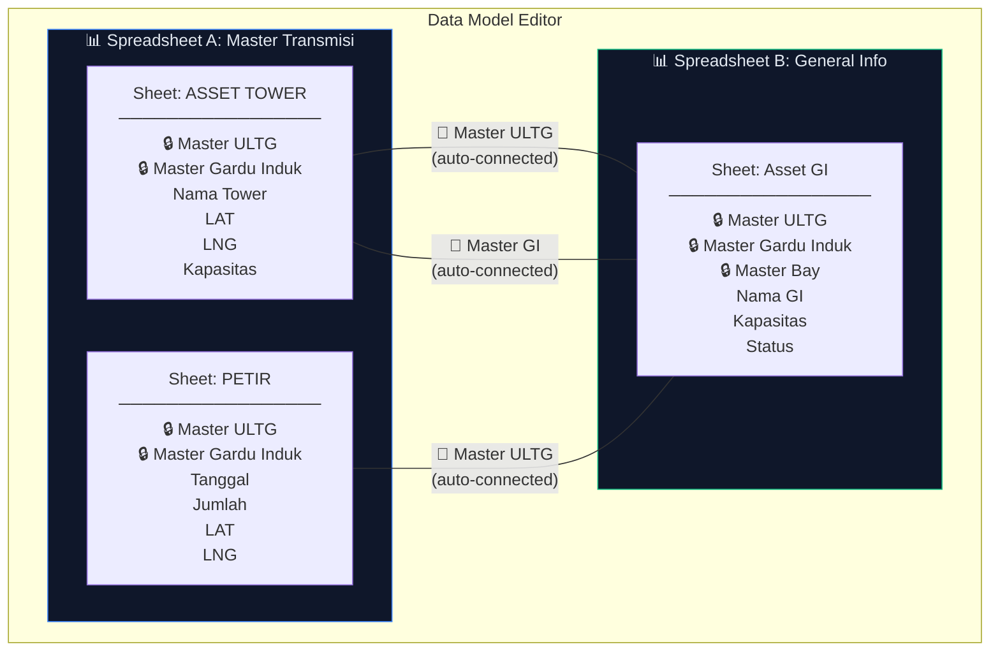

**Aturan:**
- 🔒 Kolom hirarki (`Master ULTG`, `Master Gardu Induk`, `Master Bay`) **otomatis terhubung** antar semua sheet — garis sudah ada dari awal, tidak bisa dihapus
- 🔗 User bisa **tarik garis** dari kolom biasa di Sheet A ke kolom biasa di Sheet B untuk membuat relasi tambahan (misal: kolom `Kode_GI` di sheet satu ke `ID_GI` di sheet lain)
- Setiap node menampilkan nama sheet + daftar kolom
- Warna garis: biru = hirarki (otomatis), kuning = manual (user-defined)

**Konsep UI:**

```
┌─────────────────────────────────────────────────────────────┐
│  📐 Data Model Editor                              [Lanjut →]│
│                                                              │
│  ┌─ Master Transmisi ───────┐    ┌─ General Info ──────────┐ │
│  │ 📄 ASSET TOWER           │    │ 📄 Asset GI             │ │
│  │ ┌──────────────────────┐ │    │ ┌──────────────────────┐ │ │
│  │ │ 🔒 Master ULTG       │─╋────╋─│ 🔒 Master ULTG       │ │ │
│  │ │ 🔒 Master Gardu Induk│─╋────╋─│ 🔒 Master Gardu Induk│ │ │
│  │ │    Nama Tower        │ │    │ │ 🔒 Master Bay         │ │ │
│  │ │    LAT               │ │    │ │    Nama GI            │ │ │
│  │ │    LNG               │ │    │ │    Kapasitas          │ │ │
│  │ │    Kapasitas          │ │    │ │    Status             │ │ │
│  │ └──────────────────────┘ │    │ └──────────────────────┘ │ │
│  │                          │    │                          │ │
│  │ 📄 PETIR                 │    └──────────────────────────┘ │
│  │ ┌──────────────────────┐ │                                │
│  │ │ 🔒 Master ULTG       │─╋── (auto-connected) ──────────  │
│  │ │ 🔒 Master Gardu Induk│─╋── (auto-connected) ──────────  │
│  │ │    Tanggal            │ │                                │
│  │ │    Jumlah             │ │                                │
│  │ │    LAT                │ │                                │
│  │ │    LNG                │ │                                │
│  │ └──────────────────────┘ │                                │
│  └──────────────────────────┘                                │
│                                                              │
│  🔗 Relasi: 3 otomatis (hirarki) · 0 manual                  │
│  📊 Total: 3 sheet · 2 spreadsheet · 15 kolom                │
└─────────────────────────────────────────────────────────────┘
```

---

### 10.2 Tahap B — Dashboard Designer (Drag & Drop)

Setelah data model selesai, user masuk ke canvas drag-and-drop untuk menyusun layout halaman dashboard.

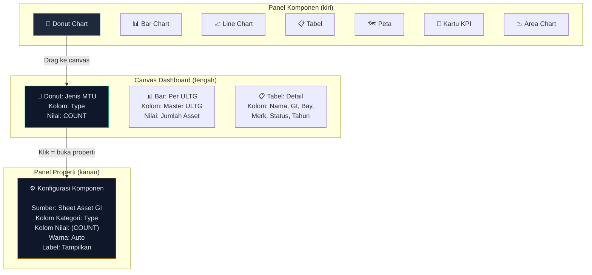

**Alur Penggunaan:**

1. **Drag** komponen dari panel kiri ke canvas
2. **Klik** komponen di canvas → panel properti muncul di kanan
3. **Pilih kolom**: Modal tampil, user pilih:
   - Dari sheet mana?
   - Kolom kategori (sumbu-X / slice label)
   - Kolom nilai (sumbu-Y / slice value)
   - Agregasi (COUNT / SUM / AVG / MIN / MAX)
4. **Atur ukuran**: Resize komponen di canvas (grid-based)
5. **Preview**: Klik "Preview" → lihat dashboard dengan data asli
6. **Simpan**: Generate halaman Next.js otomatis

**Konsep UI:**

```
┌──────────────────────────────────────────────────────────────────┐
│  🎨 Dashboard Designer                    [Preview] [Simpan ✅]  │
│                                                                   │
│  Komponen:    ┌─────────────────────────────────────────────┐     │
│  ┌─────────┐ │                                             │     │
│  │🍩 Donut │ │  ┌──────────────┐  ┌───────────────────┐   │     │
│  │📊 Bar   │ │  │ 🍩 Donut     │  │ 📊 Bar Chart      │   │     │
│  │📈 Line  │ │  │ Jenis MTU    │  │ Asset per ULTG    │   │     │
│  │📋 Tabel │ │  │              │  │ ████ ███ █████    │   │     │
│  │🗺️ Peta  │ │  └──────────────┘  └───────────────────┘   │     │
│  │🔢 KPI   │ │                                             │     │
│  │📉 Area  │ │  ┌──────────────────────────────────────┐   │     │
│  └─────────┘ │  │ 📋 Tabel Detail Peralatan             │   │     │
│              │  │ Nama │ GI │ Bay │ Merk │ Status │ Thn │   │     │
│  ⚙️ Properti: │  │ PMT1 │ CIC│ Kop │ ABB  │ Aktif  │ 20 │   │     │
│  ┌─────────┐ │  │ DS2  │ CIB│ Tra │ SIEM │ Aktif  │ 19 │   │     │
│  │Sheet:   │ │  └──────────────────────────────────────┘   │     │
│  │Asset GI │ │                                             │     │
│  │         │ └─────────────────────────────────────────────┘     │
│  │Kategori:│                                                     │
│  │Type  [▼]│  Cross-filter aktif: Klik komponen manapun          │
│  │Nilai:   │  → filter semua komponen lain                       │
│  │COUNT [▼]│                                                     │
│  └─────────┘                                                     │
└──────────────────────────────────────────────────────────────────┘
```

---

### 10.3 Tabel Input Komponen

Setiap komponen visualisasi pada dasarnya hanya butuh **kolom** sebagai input:

| Komponen | Input Wajib | Input Opsional | Output |
|----------|------------|----------------|--------|
| 🍩 Donut Chart | 1 kolom kategori | agregasi (COUNT/SUM) | Pie slices |
| 📊 Bar Chart | 1 kolom kategori + 1 kolom nilai | orientasi (H/V), grouping | Bars |
| 📈 Line Chart | 1 kolom sumbu-X (tanggal/urutan) + N kolom nilai | smooth, area fill | Lines |
| 📋 Tabel | N kolom apa saja | sorting, pagination, search | Baris & kolom |
| 🗺️ Peta | 2 kolom (LAT + LNG) | kolom label, kolom warna | Markers |
| 🔢 Kartu KPI | 1 kolom nilai + agregasi | label, ikon, warna | Angka besar |
| 📉 Area Chart | 1 kolom sumbu-X + N kolom nilai | stacked, gradient | Area fills |

> [!TIP]
> Prinsip fundamental: **Semua visualisasi = Spreadsheet + Sheet + Kolom**. Tidak lebih. Komponen hanyalah "pembungkus" visual di atas data kolom.

---

### 10.4 Alur Lengkap Page Builder

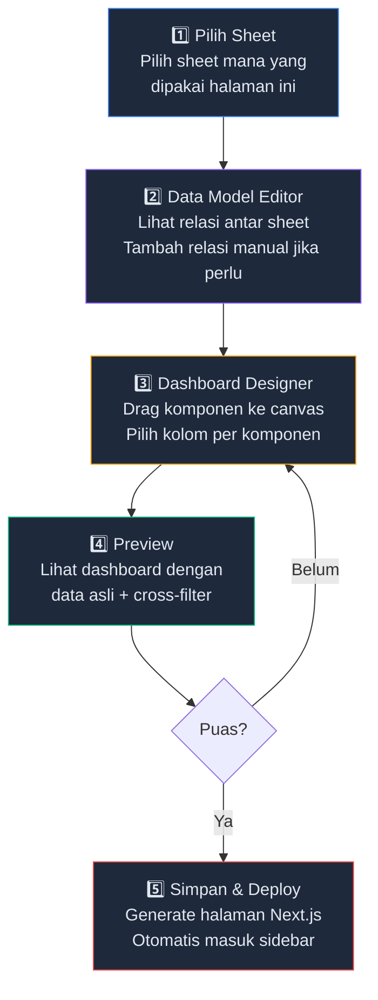

---

## 11. Rekomendasi Package & Dependencies

Berdasarkan riset di Context7, berikut package enterprise-grade yang direkomendasikan per komponen Page Builder:

### 11.1 Data Model Editor — Relationship UI

| Package | Versi | Stars | Kegunaan |
|---------|-------|-------|----------|
| **`@xyflow/react` (React Flow)** | 11.x | 26k+ ⭐ | Editor node-based untuk visualisasi relasi antar sheet |

> [!IMPORTANT]
> **React Flow** adalah standar industri untuk node-based UI. Dipakai oleh Stripe, Typeform, dan banyak BI tool. Fitur kunci untuk kita:
> - **Custom nodes** — setiap sheet jadi node dengan daftar kolom
> - **Handles** — setiap kolom punya connection point (handle) untuk ditarik garisnya
> - **Auto-layout** — node otomatis tersusun rapi
> - **Edges** — garis relasi antar kolom (biru = hirarki otomatis, kuning = manual)
> - **MiniMap + Controls** — navigasi di canvas besar
> - **TypeScript native** — fully typed

```bash
npm install @xyflow/react
```

---

### 11.2 Dashboard Designer — Grid Layout

| Package | Versi | Stars | Kegunaan |
|---------|-------|-------|----------|
| **`react-grid-layout`** | 1.x | 20k+ ⭐ | Grid layout drag-and-drop yang resizable |

> [!TIP]
> **react-grid-layout** lebih cocok dari dnd-kit untuk kasus dashboard builder karena sudah built-in:
> - **Grid-based layout** — snap to grid, auto-arrange
> - **Resizable widgets** — user bisa resize setiap chart/tabel
> - **Responsive breakpoints** — layout otomatis adaptasi per ukuran layar
> - **Serializable** — layout bisa disimpan sebagai JSON dan di-load ulang
> - Dipakai oleh Grafana, Metabase, dan dashboard builder lainnya

```bash
npm install react-grid-layout
npm install -D @types/react-grid-layout
```

---

### 11.3 Drag & Drop — Komponen ke Canvas

| Package | Versi | Stars | Kegunaan |
|---------|-------|-------|----------|
| **`@dnd-kit/core`** | 6.x | 13k+ ⭐ | Drag komponen dari panel ke canvas |
| **`@dnd-kit/sortable`** | | | Sortable items di dalam grid |

> Digunakan khusus untuk **drag komponen dari panel kiri ke canvas**, bukan untuk layout grid (itu tugas react-grid-layout). Fitur kunci:
> - **Sensor system** — support mouse, keyboard, touch
> - **DragOverlay** — preview saat drag
> - **Collision detection** — akurat menentukan drop target
> - **Accessible** — keyboard navigation built-in

```bash
npm install @dnd-kit/core @dnd-kit/sortable @dnd-kit/utilities
```

---

### 11.4 Visualisasi Chart — Drill-Down & Cross-Filter

| Package | Versi | Stars | Kegunaan |
|---------|-------|-------|----------|
| **`echarts`** | 5.x | 62k+ ⭐ | Chart library utama (donut, bar, line, area, dll) |
| **`echarts-for-react`** | 3.x | 4.5k+ ⭐ | React wrapper untuk ECharts |

> Apache ECharts sudah ada di project ini. Fitur kunci untuk drill-down:
> - **Event system** — `chart.on('click', callback)` untuk menangkap klik pada slice/bar
> - **dispatchAction** — programmatic highlight/downplay untuk cross-filter
> - **Multi-state** — click-to-select bawaan di ECharts 5
> - **Dark theme** — sesuai tema dashboard
> - **Responsive** — auto-resize

```bash
# Sudah terinstall
npm install echarts echarts-for-react
```

---

### 11.5 Tabel Data — Enterprise Grid

| Package | Versi | Stars | Kegunaan |
|---------|-------|-------|----------|
| **`@tanstack/react-table`** | 8.x | 26k+ ⭐ | Headless table — full kontrol UI |

> **TanStack Table** (sebelumnya React Table) adalah standar industri untuk data table. Fitur kunci:
> - **Headless** — kita kontrol penuh tampilan (cocok dengan shadcn/ui)
> - **Column visibility** — user bisa show/hide kolom
> - **Sorting & filtering** — per kolom, client-side
> - **Pagination** — bawaan
> - **Row selection** — untuk cross-filter (klik row → filter chart lain)

```bash
npm install @tanstack/react-table
```

> [!NOTE]
> **Alternatif**: Jika butuh fitur lebih advanced (editable cells, Excel-like), pertimbangkan **AG Grid** (Community Edition gratis, Enterprise berbayar). Tapi untuk kebutuhan kita, TanStack Table sudah cukup.

---

### 11.6 Peta — Geospasial

| Package | Versi | Stars | Kegunaan |
|---------|-------|-------|----------|
| **`maplibre-gl`** | 4.x | 7k+ ⭐ | Peta interaktif (sudah terinstall) |
| **`react-map-gl`** | 7.x | 8k+ ⭐ | React wrapper untuk MapLibre |

> Sudah ada di project. Dipakai untuk komponen `map-markers` dan `heatmap-data`.

---

### 11.7 Ringkasan Instalasi

```bash
# Package baru yang perlu diinstall
npm install @xyflow/react                    # Data Model Editor
npm install react-grid-layout                # Dashboard grid layout
npm install -D @types/react-grid-layout      # TypeScript types
npm install @dnd-kit/core @dnd-kit/sortable @dnd-kit/utilities  # Drag & drop
npm install @tanstack/react-table            # Enterprise table

# Sudah ada di project
# echarts, echarts-for-react, maplibre-gl, react-map-gl
```

### 11.8 Peta Dependency per Komponen

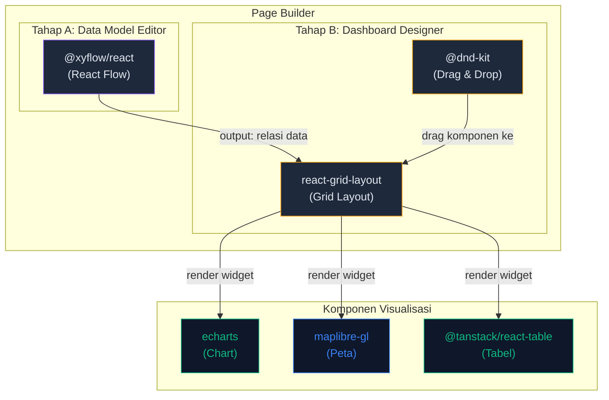
